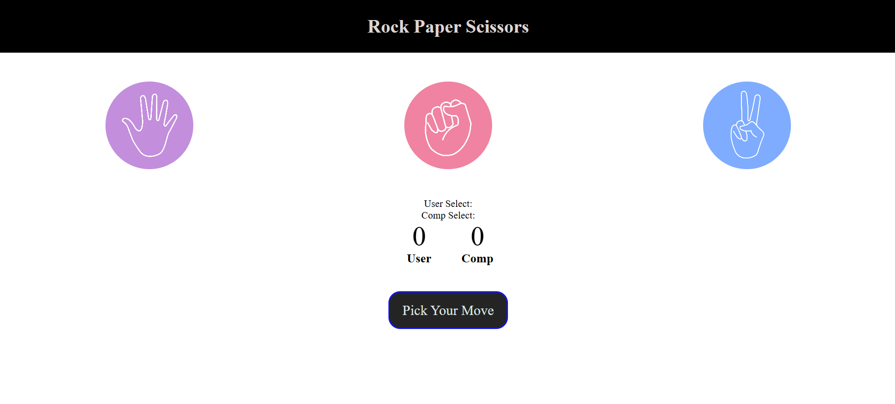

# ✊✋✌️ Rock Paper Scissors Game

A fun and interactive **Rock Paper Scissors** game built using **HTML, CSS, and JavaScript**. This project allows users to play against the computer, where the computer randomly selects its move and the winner is decided based on the classic game rules.

## 🚀 About the Project

This project was created while learning **JavaScript** to improve my understanding of programming logic, DOM manipulation, event handling, and random number generation. It is one of my beginner JavaScript projects that helped me apply theoretical concepts in a real-world application.

## ✨ Features

- 🎮 Play Rock, Paper, Scissors against the computer
- 🤖 Computer generates a random move every round
- 🏆 Automatically determines the winner
- 📊 Displays the result of each round
- 🎨 Simple, responsive, and user-friendly interface
- ⚡ Fast and interactive gameplay

## 🛠️ Technologies Used

- HTML5
- CSS3
- JavaScript (ES6)

## 📚 What I Learned

While building this project, I learned:

- JavaScript fundamentals
- DOM Manipulation
- Event Listeners
- Conditional Statements (`if...else`)
- Random Number Generation (`Math.random()`)
- Functions
- Variables and Data Types
- Building interactive web applications

## 🎯 Future Improvements

- Keep score between player and computer
- Add game reset button
- Add animations and sound effects
- Dark mode support
- Improve UI/UX
- Add game history

## 📸 Preview

## 🤝 Contributing

Suggestions and improvements are always welcome. Feel free to fork this repository and submit a pull request.

## ⭐ Support

If you like this project, please consider giving this repository a **⭐ Star**. It motivates me to continue learning and building more JavaScript projects.

---

**Made with ❤️ while learning JavaScript.**
